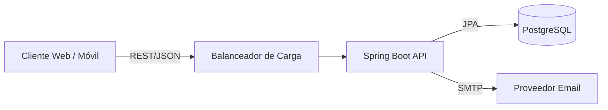

# 🏗 Arquitectura Técnica

## Diseño del Sistema

El sistema sigue una arquitectura de **Monolito Modular** en el backend y una **Single Page Application (SPA)** en el frontend. Aunque es un monolito en despliegue, está diseñado con separación de contextos (Services/Controllers) que facilitarían una eventual migración a microservicios si fuera necesario.

### Diagrama de Contexto (Nivel 1)

### Diagrama de Contenedores (Nivel 2)

| Contenedor | Tecnología | Responsabilidad |
| :--- | :--- | :--- |
| **Web App** | React 19 + Vite | Interfaz de usuario, navegación, branding y experiencias B2B/B2C. |
| **API Server** | Java 21 + Spring Boot 3 | Lógica de negocio, seguridad, validación, tenancy y orquestación de datos. |
| **Database** | PostgreSQL 15 | Persistencia relacional de datos. |

---

## 🧩 Patrones de Diseño

### Backend (Layered Architecture)

El código se organiza en capas horizontales para separar responsabilidades:

1. **Controller Layer (`com.saloria.controller`)**:
    - Maneja las peticiones HTTP.
    - Valida entradas (DTOs).
    - Delega a servicios.
    - Retorna respuestas estandarizadas.

2. **Service Layer (`com.saloria.service`)**:
    - Contiene la lógica de negocio pura.
    - Transaccionalidad (`@Transactional`).
    - Manejo de reglas de negocio (e.g. "No se puede cancelar una cita 1 hora antes").

3. **Persistence Layer (`com.saloria.repository`)**:
    - Interfaces `JpaRepository`.
    - Abstracción del acceso a datos.

### Frontend (Arquitectura Híbrida por Features + Dominios)

El frontend mezcla `features/` para flujos transversales (`auth`, `client-portal`) con `components/` y `pages/` por dominio de producto (`appointments`, `customers`, `services`, `dashboard`, `marketplace`). Esto permite reutilizar UI de negocio sin forzar una única taxonomía.

---

## 🔐 Seguridad y Autenticación

- **Modelo**: autenticación stateless con JWT propio firmado por el backend.
- **Flujo**:
    1. Cliente envía credenciales (`POST /auth/login`).
    2. Servidor valida y retorna `token` (JWT).
    3. Cliente almacena el token en `localStorage` y reconstruye sesión en el arranque.
    4. Cliente envía header `Authorization: Bearer <token>` en cada petición.
- **Roles**:
  - `ROLE_ADMIN`: Acceso total a la configuración de su `Enterprise`.
  - `ROLE_EMPLEADO`: Acceso operativo a agenda y citas.
  - `ROLE_CLIENTE`: Acceso a su propio perfil y reservas.
  - `ROLE_SUPER_ADMIN`: Acceso transversal a todas las empresas.

---

## 🏢 Estrategia Multi-tenant

El sistema utiliza una estrategia de **tenant por referencia explícita** basada en `enterprise_id`.

- Todas las tablas principales (`users`, `appointments`, `services`) tienen una columna `enterprise_id`.
- Cada petición autenticada se asocia a un usuario que pertenece a una `Enterprise`.
- **Seguridad**: el aislamiento no depende de magia de ORM. Se aplica con `@PreAuthorize`, `SecurityService`, métodos de repositorio filtrados y validaciones explícitas en servicios críticos como creación de citas.

> [Siguiente: Backend](./04-backend.md)
